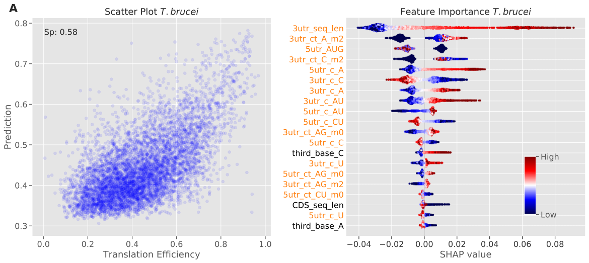

[](https://mybinder.org/v2/gh/mtinti/decoding-gene-expression/HEAD)

[](https://doi.org/10.5281/zenodo.14647227)

# Translation Efficiency Analysis in Trypanosomatids

This repository contains the analysis pipeline for studying translation efficiency and mRNA abundance in trypanosomatids using machine learning approaches.




## Quick Start with MyBinder
[](https://mybinder.org/v2/gh/mtinti/decoding-gene-expression/HEAD)

Click the Binder badge above to launch the notebooks in an interactive environment without local installation.

## Local Installation

### Setting up the Environment

1. Clone the repository:
```bash
git clone mtinti/decoding-gene-expression
cd yourrepository
```

2. Create and activate a virtual environment:
```bash
# Using conda
conda create -n tryp_analysis python=3.9
conda activate tryp_analysis
```

3. Install requirements:
```bash
pip install -r requirements.txt
```

## Running the Analysis

### Notebook Structure
The analysis is organized into several Jupyter notebooks:

- `TB/TB.ipynb`: T. brucei analysis
- `TB_pcf/TB.ipynb`: T. brucei procyclic form analysis
- `TC/TC.ipynb`: T. cruzi analysis
- `LD/LD.ipynb`: L. donovani analysis
- `compare.ipynb`: Comparative analysis and figure generation

### Analysis Options

Each species-specific notebook contains a configuration cell at the beginning with the variable:
```python
MAKE_SCORES = True  # Set to False to use pre-computed results
```

- When `MAKE_SCORES = True`: The notebook will run the complete machine learning analysis with different feature sets and random seed splits
- When `MAKE_SCORES = False`: The notebook will use pre-computed results from the following files:
  - `{specie}/stats_{specie}_{response_variable}_{feature_set}.csv`

### Running Order

1. First, run the species-specific notebooks:
   - `TB/TB.ipynb`
   - `TB_pcf/TB.ipynb`
   - `TC/TC.ipynb`
   - `LD/LD.ipynb`

2. Then run `compare.ipynb` to generate the final figures for the paper

### Pre-computed Results
Pre-computed results are available in each species directory for quick reproduction of figures without running the full analysis. These files follow the naming pattern:
```
{specie}/stats_{specie}_{response_variable}_{feature_set}.csv
```
Where:
- `specie`: TB (T. brucei), TC (T. cruzi), or LD (L. donovani)
- `response_variable`: TE (Translation Efficiency) or mRNA Abundance
- `feature_set`: utr, codon, or ALL

## Expected Output
The notebooks will generate:
- Statistical analysis of translation efficiency and mRNA abundance
- Feature importance analysis using SHAP values
- Comparative analysis across species
- Publication-ready figures

## Contact
For questions or issues, please open an issue on GitHub or contact the authors:
- Michele Tinti (m.tinti@dundee.ac.uk)
- David Horn (d.horn@dundee.ac.uk)


